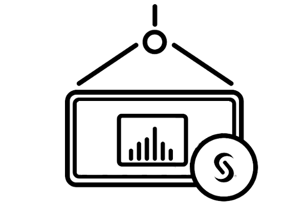
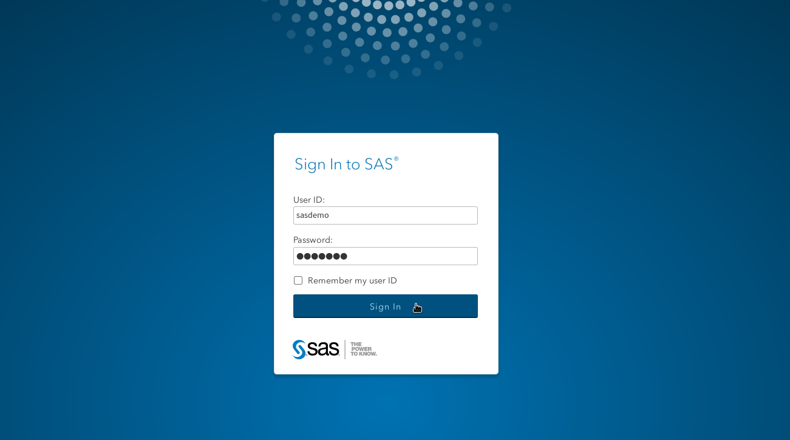

<div align="left">
<h1>SAS<sup>®</sup> Viya<sup>®</sup> Container Recipes -- Archived Repository</h1>
<p><strong>SAS has archived the SAS Viya 3.5 for containers repository in the sassoftware organization on GitHub.  No further changes or issues will be allowed in this repository. We recommend exploring the new cloud-ready version of SAS Viya for future deployments.</strong></p>

---

</div>
<div align="center">



<p>A framework to build SAS Viya Docker images and create deployments using Kubernetes.</p>

<a href="https://www.sas.com/en_us/software/viya.html">
    </a>
<a href="https://www.docker.com/">
    </a>
<a href="https://kubernetes.io/">
    </a>
</div>

<br>
Container deployments are more lightweight and don't have as much
overhead as traditional virtual machines. By running a SAS engine inside a
container, you can provision resources more efficiently to address a wide variety
of SAS workloads. Select a base SAS recipe and create custom containers
that include access to different data sources (PC files, Oracle, Hadoop, etc.), the addition of a Jupyter Notebook with Python 3, and more.

For more information, see [SAS for Containers](http://support.sas.com/rnd/containers/).

<br>

## Quick Start
Use the following instructions to quickly build and launch SAS Viya containers.
For extensive information about building and running SAS Viya containers,
see the [documentation wiki](https://github.com/sassoftware/sas-container-recipes/wiki).
For single and multiple containers, addons found in the
[addons directory](https://github.com/sassoftware/sas-container-recipes/tree/master/addons)
can enhance the base SAS Viya images with SAS/ACCESS software, LDAP configuration, and more.
For information about how to use the addons and any prerequisites, see the [documentation about addons](https://github.com/sassoftware/sas-container-recipes/wiki/Appendix-Under-the-Hood#addons).

1. Locate your SAS Viya for Linux Software Order Email (SOE), and retrieve the
`SAS_Viya_deployment_data.zip` file from it. Not sure if your organization
purchased SAS Software? [Contact Us](https://www.sas.com/en_us/software/how-to-buy.html)
or get [SAS License Assistance](https://support.sas.com/en/technical-support/license-assistance.html).
If you have not purchased SAS Software but would like to give it a try,
please check out our [Free Software Trials](https://www.sas.com/en_us/trials.html).

2. Download the latest <a href="https://github.com/sassoftware/sas-container-recipes/releases" alt="SAS Container Recipes Releases">
        </a>
or `git clone git@github.com:sassoftware/sas-container-recipes.git`

3. Choose your flavor and follow the recipe to build, test, and deploy your container(s).

    a. If you are looking for an environment tailored towards individual data scientists and developers, you will be interested in a [SAS programming-only deployment running on a single container](https://github.com/sassoftware/sas-container-recipes#for-a-single-user---sas-viya-programming-only-deployment-running-on-a-single-container).

    b. If you would like an environment suitable for collaborative data science work, then you may be interested in a SAS programming-only deployment or a SAS Viya full [deployment on multiple containers](https://github.com/sassoftware/sas-container-recipes#for-one-or-more-users---sas-viya-programming-only-or-sas-viya-full-deployment-running-on-multiple-containers).

<br>

---

<br>

## For a Single User - SAS Viya Programming-Only Deployment Running on a Single Container

Use these instructions to create a SAS Viya programming-only deployment in a single container for
an independent data scientist or developer to execute SAS code. All code and
data should be stored in a persistent location outside the container.
This deployment includes SAS Studio, SAS Workspace Server, and a CAS server,
which provides in-memory analytics for symmetric multi-processing (SMP).

### Prerequisites

- **Strongly recommended:** Create a local mirror repository of the SAS software. [Here's why](https://github.com/sassoftware/sas-container-recipes/wiki/The-Basics#why-do-i-need-a-local-mirror-repository).
- A [supported version](https://success.docker.com/article/maintenance-lifecycle) of [Docker-CE (Community Edition)](https://docs.docker.com/install/linux/docker-ce/centos/) is required.

### Build the Image

Run the following command to build the container image and add a default user ID (sasdemo) and password (sasdemo), which can be used to sign in to SAS Studio after the container is running. A [non-root user](https://docs.docker.com/install/linux/linux-postinstall/#manage-docker-as-a-non-root-user) is recommended for executing the build command.

```
 ./build.sh --type single --zip ~/path/to/SAS_Viya_deployment_data.zip --addons "auth-demo"
```

### Run the Container

After the container image is built, the instructions for running the container will be printed at the end of the build.sh output.

```
mkdir -p run
cp samples/viya-single-container/example_launchsas.sh run/launchsas.sh
cd run
sed -i 's|@REPLACE_ME_WITH_TAG@|19.05.0-20190509195121-d991185|' launchsas.sh
./launchsas.sh
```
Use the `docker images` command to see the images that were built and the most recent tag (example: tag `19.05.0-20190509195121-d991185`).

After the launchsas.sh command is completed, use `docker ps` to list the running container.

### Sign In to SAS Studio

Go to `http://<myhostname>:8080`, and then sign in with the sasdemo user ID and the sasdemo password to start using SAS Studio!



For more information, see the [documentation wiki](https://github.com/sassoftware/sas-container-recipes/wiki).

<br>

---

<br>

## For One or More Users - SAS Viya Programming-Only or SAS Viya Full Deployment Running on Multiple Containers

Use these instructions to build multiple Docker images and then use the images
to create a SAS Viya programming-only or a SAS Viya full deployment in Kubernetes.
These deployments can have SMP or massively parallel processing (MPP) CAS servers,
which provide in-memory analytics and can be used by one or more users.

A programming-only deployment supports data scientists and programmers who use
SAS Studio or direct programming interfaces such as Python or REST APIs.
Note that a programming-only deployment does not include SAS Drive,
SAS Environment Manager, and the complete suite of services that are
included with a full deployment. Make sure that you provide
your users with the features that they require.

### Prerequisites

- A [supported version](https://success.docker.com/article/maintenance-lifecycle) of [Docker-CE](https://docs.docker.com/install/linux/docker-ce/centos/) (Community Edition) must be installed on the Linux or Mac build machine.
- Access to a Docker registry: The build process will push built Docker images automatically to the Docker registry. Before you run `build.sh`, run `docker login docker.registry.company.com`, and then make sure that the values in `$HOME/.docker/config.json` are correct.
- Access to a Kubernetes environment and [kubectl](https://kubernetes.io/docs/tasks/tools/install-kubectl/) installed (required for the deployment step but not required for the build step).
- **Strongly recommended:** Create a local mirror repository of the SAS software. [Here's why](https://github.com/sassoftware/sas-container-recipes/wiki/The-Basics#why-do-i-need-a-local-mirror-repository).

**Note**: Users of Kubernetes clusters running v1.16.0+ should use [the "kubernetes-1.16.0-compat" branch](https://github.com/sassoftware/sas-container-recipes/tree/kubernetes-1.16.0-compat).

### How to Build
Examples of running `build.sh` to build multiple containers are provided below. A [non-root user](https://docs.docker.com/install/linux/linux-postinstall/#manage-docker-as-a-non-root-user) is recommended for executing the build command.

**Tip:** For the list of all required and optional arguments, see the docs/usage.txt file, or run `./build.sh --help` .

#### Example One: Programming-Only Deployment, Multiple Containers

```
  ./build.sh \
  --type multiple \
  --zip /path/to/SAS_Viya_deployment_data.zip \
  --docker-registry-namespace myuniquename \
  --docker-registry-url myregistry.myhost.com \
  --addons "auth-demo"
```

Here's a summary of what this command does:
- Multiple Docker images for a programming-only deployment are created: `--type multiple`.
- The software that is deployed is determined by the software entitlement that is provided in the ZIP file from the Software Order Email: `--zip /path/to/SAS_Viya_deployment_data.zip` .
- The images are pushed to the namespace in the Docker Registry, which is located at the Docker registry URL: `--docker-registry-namespace myuniquename`, `--docker-registry-url myregistry.myhost.com`.
- A default user ID (sasdemo) and password (sasdemo) are added, which can be used to sign in to SAS Studio: `--addons "auth-demo"`.

#### Example Two: Full Deployment, Multiple Containers (Experimental)

##### Considerations for a Full Deployment
  - This deployment is experimental and includes limited support from SAS.
  - A SAS Viya multi-tenant environment is not supported.
  - High availability is not currently supported for full and multiple deployments using Kubernetes.
  - Persistence is not currently functional when scaling. Scaling down to 0 and back up from 0 will result in the loss of data.

```
  ./build.sh \
  --type full \
  --zip /path/to/SAS_Viya_deployment_data.zip \
  --docker-registry-namespace myuniquename \
  --docker-registry-url myregistry.myhost.com \
  --addons "auth-sssd"
```

Here's a summary of what this command does:
- Multiple Docker images for a full deployment are created: `--type full`.
- The software that is deployed is determined by the software entitlement that is provided in the ZIP file from the Software Order Email: `--zip /path/to/SAS_Viya_deployment_data.zip`.
- The images are pushed to the namespace in the Docker Registry, which is located at the Docker registry URL: `--docker-registry-namespace myuniquename`, `--docker-registry-url myregistry.myhost.com`.
- SSSD is configured inside the container to allow the container authentication to connect to LDAP or Active Directory: `--addons "auth-sssd"`.


**Note:** Before you use the auth-sssd addon, see the [documentation wiki](https://github.com/sassoftware/sas-container-recipes/wiki/Appendix-Under-the-Hood#auth-sssd) for prerequisite information.

### Running Multiple Containers

The build process creates Kubernetes manifests that you use to run multiple containers.

   * For a SAS Viya programming-only deployment, the manifests are located at `builds/multiple/manifests/`.
   * For a SAS Viya full deployment, the manifests are located at `builds/full/manifests/`.

For information about using the manifests, see [Build and Run SAS Viya Multiple Containers](https://github.com/sassoftware/sas-container-recipes/wiki/Build-and-Run-SAS-Viya-Multiple-Containers).

### Sign In to SAS Studio

After the containers are running, users can sign on to SAS Studio.

- If you deployed a programming-only environment, then your environment contains SAS Studio 4.4.
- If you deployed a full environment, then your environment contains both SAS Studio 4.4 and SAS Studio 5.1. By default, you will sign in to SAS Studio 5.1.

Here are some examples of how to sign in:

- For SAS Studio 4.4 via Kubernetes:

  `https://ingress-path/SASStudio`

- For SAS Studio 5.1:

  `https://ingress-path/SASStudioV`


<br>

---

<br>

## Additional Resources

- [Wiki: documentation](https://github.com/sassoftware/sas-container-recipes/wiki)
- [Issues: Questions and Project Improvements](https://github.com/sassoftware/sas-container-recipes/issues)
- [Kubernetes Documentation](https://kubernetes.io/docs/home/)
- [Docker Documentation](https://docs.docker.com/)
- [SAS License Assistance](https://support.sas.com/en/technical-support/license-assistance.html)
- [SAS Software Purchase](https://www.sas.com/en_us/software/how-to-buy.html)
- [SAS Software Trial](https://www.sas.com/en_us/trials.html)

<br>

---

<br>

## Copyright

Copyright 2018 SAS Institute Inc.

Licensed under the Apache License, Version 2.0 (the "License");
you may not use this file except in compliance with the License.
You may obtain a copy of the License at

&nbsp;&nbsp;&nbsp;&nbsp;https://www.apache.org/licenses/LICENSE-2.0

Unless required by applicable law or agreed to in writing, software
distributed under the License is distributed on an "AS IS" BASIS,
WITHOUT WARRANTIES OR CONDITIONS OF ANY KIND, either express or implied.
See the License for the specific language governing permissions and
limitations under the License.
